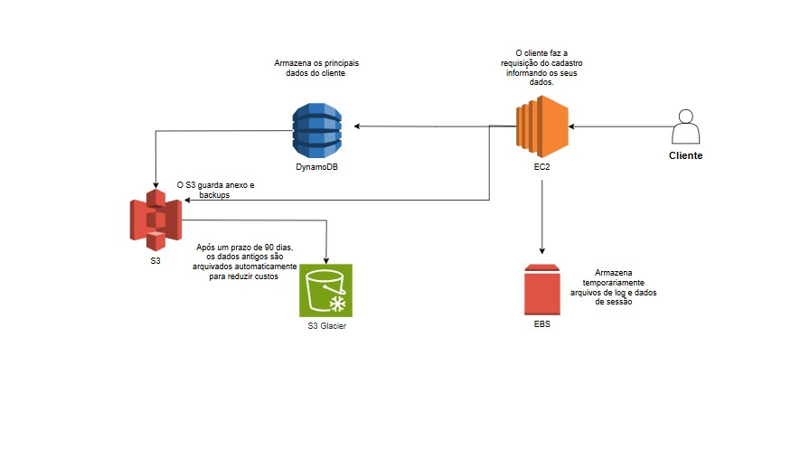

# Projeto: Integração de Serviços AWS — EC2, S3, DynamoDB e Glacier

## Descrição
Este projeto foi desenvolvido como parte do **Desafio de Projeto da DIO**, com o objetivo de aplicar conhecimentos sobre **instâncias EC2** e sua integração com outros serviços da AWS.

A proposta é criar uma arquitetura que **simule o cadastro de clientes**, armazenando dados em diferentes serviços conforme sua finalidade — garantindo performance, segurança e otimização de custos.

---

## Arquitetura AWS
Abaixo está o diagrama representando o fluxo de dados entre os serviços utilizados:

---

## Fluxo de Funcionamento

1. **Cliente**  
   O cliente realiza uma requisição de cadastro, informando seus dados por meio de uma aplicação hospedada em uma instância **EC2**.

2. **EC2 (Elastic Compute Cloud)**  
   Responsável por processar as requisições e fazer a integração com os demais serviços da AWS.

3. **EBS (Elastic Block Store)**  
   Armazena temporariamente arquivos de **log** e **dados de sessão** gerados durante o processo de cadastro.

4. **DynamoDB**  
   Guarda os **principais dados dos clientes**, como nome, CPF, e-mail e demais informações estruturadas.

5. **S3 (Simple Storage Service)**  
   Utilizado para armazenar **anexos** e **backups** de dados.

6. **S3 Glacier**  
   Após um período de **90 dias**, os dados antigos são movidos automaticamente do S3 para o Glacier, reduzindo custos de armazenamento.

---

## Serviços AWS Utilizados
| Serviço | Função Principal |
|----------|------------------|
| **EC2** | Hospedagem da aplicação que processa o cadastro dos clientes |
| **EBS** | Armazenamento temporário de logs e dados de sessão |
| **DynamoDB** | Banco de dados NoSQL para armazenar informações dos clientes |
| **S3** | Armazenamento de anexos e backups |
| **S3 Glacier** | Arquivamento de longo prazo e baixo custo |

---

## Benefícios da Arquitetura
- Escalabilidade e alta disponibilidade com EC2 e DynamoDB.  
- Armazenamento seguro e durável com S3.  
- Otimização de custos com o ciclo de vida automático para Glacier.  
- Separação clara entre dados temporários, principais e arquivados.
